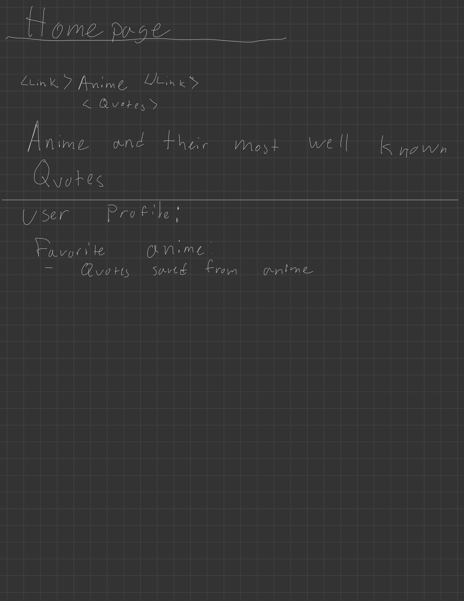
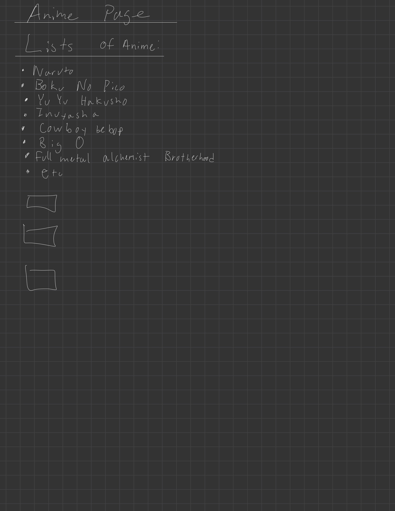

##Anime Title##
Anime tracker

##ERD##

 ##WireFram##
 
 
 

##TECH  
Technologies used: 
Express,  Node.js,  MongoDB, Mongoose

##Trello## 
Trello link: 
https://trello.com/invite/b/Jl65rX5m/ATTIc3b5c1f1ae09a7b76261bcb8cf68f6888A96F50C/project-2

##updates## 
1, update and edit quotes made, 
2, delete quotes made 
3 add pic to anime when made

##PseudoCode##

1. Set up Home page and be able to log in.
    1.1 be able to add animes to the home page for the account
    1.2 add and delete the anime and be able to edit it
2. be able to add quotes on a different page
    2.1 be able to add the quote to the page